# EasyDo - 智能化工作平台 / Intelligent Work Platform

<div align="center">


</div>

---

## 📋 目录 / Table of Contents

- [项目简介 / Project Introduction](#项目简介--project-introduction)
- [核心功能 / Core Features](#核心功能--core-features)
- [功能截图 / Feature Screenshots](#功能截图--feature-screenshots)
- [技术架构 / Tech Stack](#技术架构--tech-stack)
- [项目结构 / Project Structure](#项目结构--project-structure)
- [快速开始 / Quick Start](#快速开始--quick-start)
- [测试账号 / Test Accounts](#测试账号--test-accounts)

---

## 项目简介 / Project Introduction

EasyDo 是一个**智能化工作平台**，旨在为团队提供一站式的 DevOps 解决方案。本项目旨在复刻并优化企业级 CI/CD 工作流管理功能，提供更友好的用户界面和更完善的功能支持。

EasyDo is an **intelligent work platform** designed to provide teams with a one-stop DevOps solution. This project aims to replicate and optimize enterprise-level CI/CD workflow management features while offering a more friendly user interface and comprehensive functionality support.

### 🎯 项目目标 / Project Goals

1. 复刻企业级 DevOps 平台核心功能（流水线、项目管理、发布部署等）
   Replicate core enterprise DevOps platform features (pipeline, project management, deployment, etc.)
2. 提供更现代化、更友好的用户界面
   Provide a more modern and user-friendly interface
3. 支持灵活的扩展和定制
   Support flexible extensions and customization
4. 确保系统的稳定性和高性能
   Ensure system stability and high performance

### ✨ 核心特性 / Key Features

- 🚀 **高性能 / High Performance** - 基于 Go + Gin 构建的后端，提供卓越的性能表现
  Backend built with Go + Gin for excellent performance
- 🎨 **现代化 UI / Modern UI** - Vue 3 + Element Plus 构建的响应式界面
  Responsive interface built with Vue 3 + Element Plus
- 🔐 **安全可靠 / Secure & Reliable** - JWT 认证、密码加密，会话管理
  JWT authentication, password encryption, session management
- 📊 **统计分析 / Statistics & Analytics** - 全面的数据统计和可视化
  Comprehensive data statistics and visualization
- 🐳 **容器化部署 / Containerized Deployment** - 完整的 Docker 容器化支持
  Complete Docker containerization support
- 🔄 **可扩展性 / Extensibility** - 模块化设计，易于扩展和维护
  Modular design, easy to extend and maintain

---

## 核心功能 / Core Features

### 1. 🔐 认证模块 / Authentication Module
- 用户登录/注册 / User Login/Registration
- JWT Token 认证机制 / JWT Token Authentication
- 密码加密存储（bcrypt）/ Password Encrypted Storage (bcrypt)
- 会话管理与安全控制 / Session Management & Security Control

### 2. 🔄 流水线管理 / Pipeline Management
- 可视化流水线列表 / Visual Pipeline List
- 创建/编辑/删除流水线 / Create/Edit/Delete Pipelines
- 流水线构建历史记录 / Pipeline Build History
- 收藏常用流水线 / Favorite Common Pipelines
- 实时构建状态跟踪 / Real-time Build Status Tracking

### 3. 📁 项目管理 / Project Management
- 项目列表与分组管理 / Project List & Group Management
- 项目详情与配置 / Project Details & Configuration
- 项目统计信息展示 / Project Statistics Display
- 项目成员管理 / Project Member Management

### 4. 🚀 发布部署 / Release & Deployment
- 一键快速发布 / One-click Quick Release
- 发布历史记录 / Release History
- 版本回滚功能 / Version Rollback
- 发布部署统计 / Deployment Statistics
- 多环境部署支持 / Multi-environment Deployment Support

### 5. 📈 统计分析 / Statistics & Analytics
- 运行趋势分析 / Run Trend Analysis
- 成功率统计 / Success Rate Statistics
- Top 流水线排行 / Top Pipelines Ranking
- 时间范围筛选 / Time Range Filter
- 多维度数据可视化 / Multi-dimensional Data Visualization

### 6. ⚙️ 系统设置 / System Settings
- 基本设置 / Basic Settings
- 安全设置 / Security Settings
- 通知设置 / Notification Settings
- 用户管理 / User Management
- 第三方集成 / Third-party Integration

### 7. 👤 个人中心 / Personal Center
- 基本资料管理 / Profile Management
- 安全设置（修改密码）/ Security Settings (Change Password)
- 偏好设置 / Preference Settings
- 登录设备管理 / Login Device Management

---

## 功能截图 / Feature Screenshots

### 1. 登录 / Login

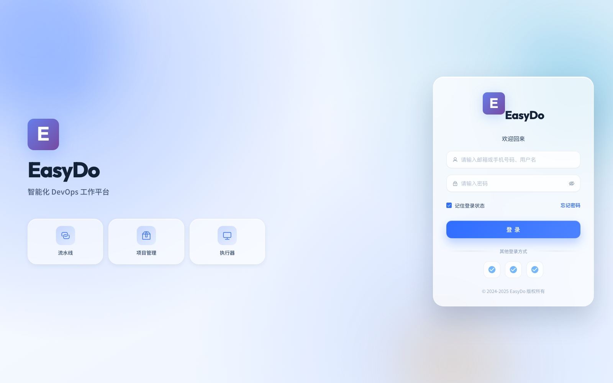

### 2. 工作台 / Dashboard

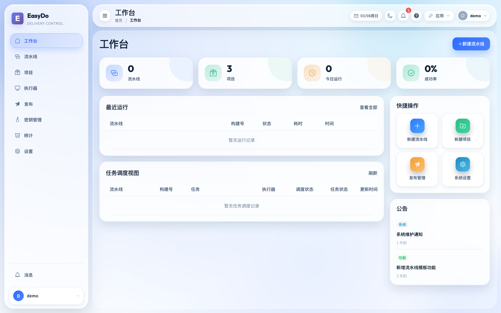

### 3. 流水线管理 / Pipeline Management

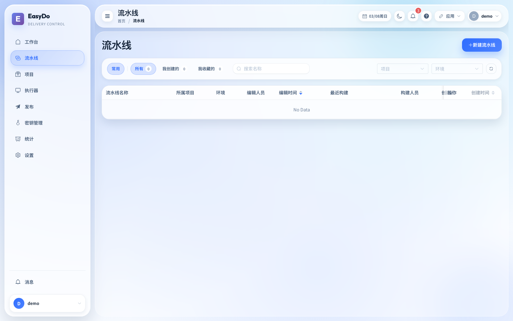

### 4. 项目管理 / Project Management

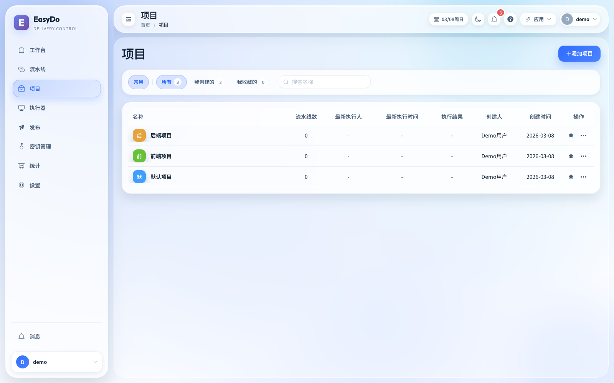

### 5. 发布部署 / Release & Deployment

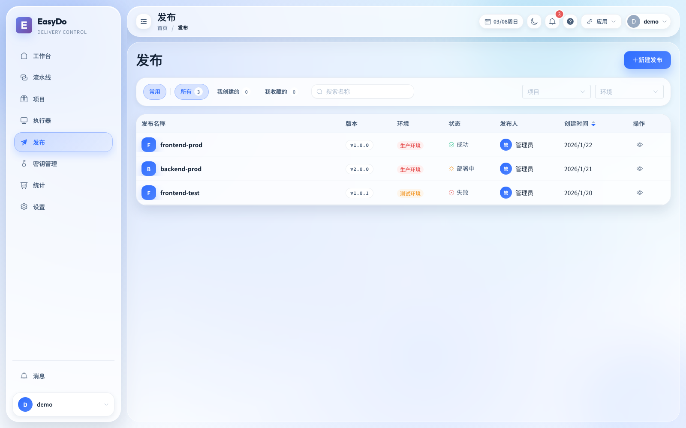

### 6. 统计分析 / Statistics

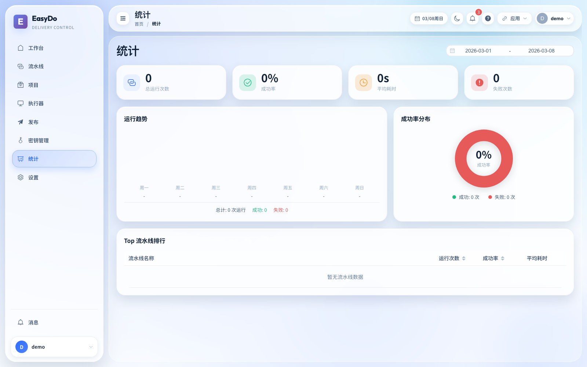

### 7. 系统设置 / System Settings

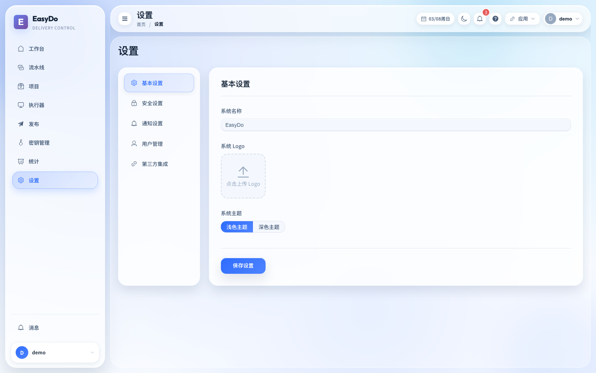

### 8. 消息中心 / Messages

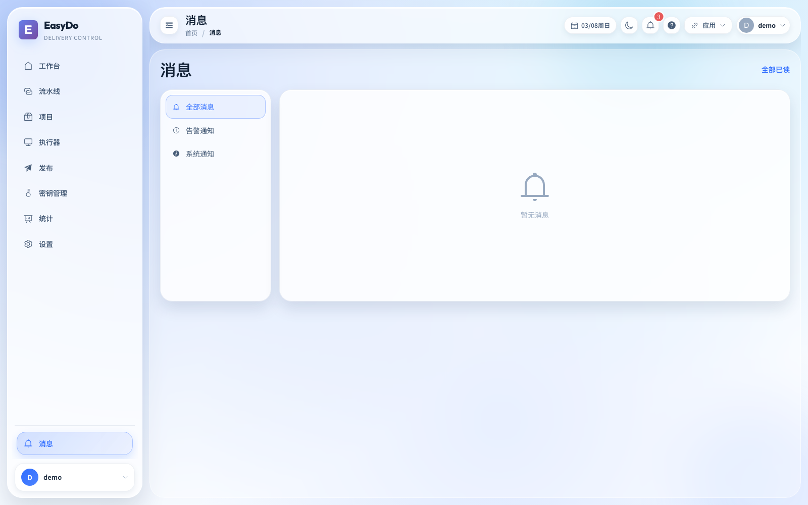

### 9. 个人中心 / Personal Center

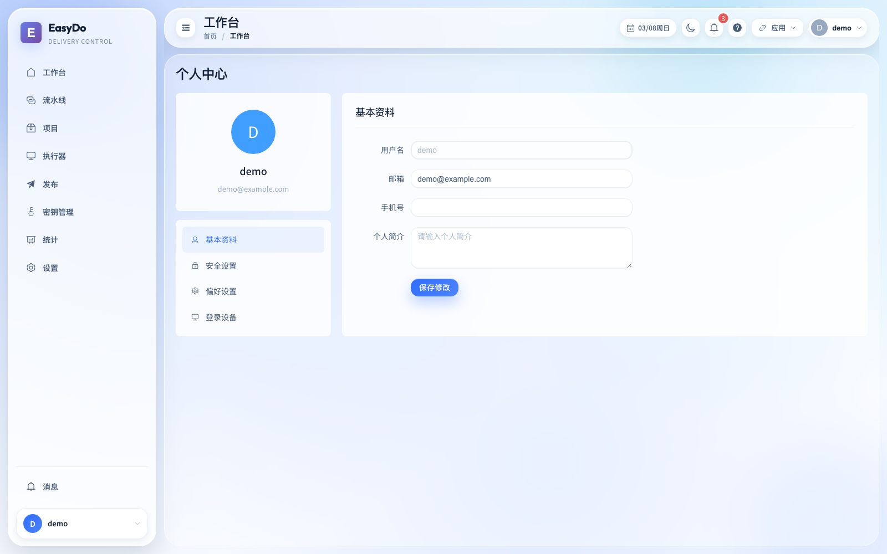

### 10. 执行器管理 / Agent Management

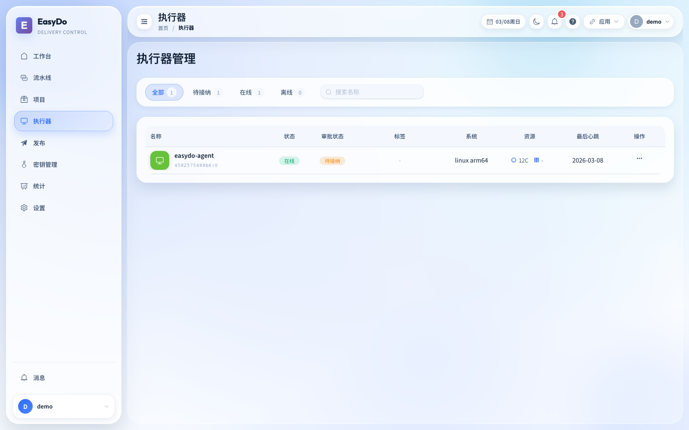

### 11. 密钥管理 / Secrets Management

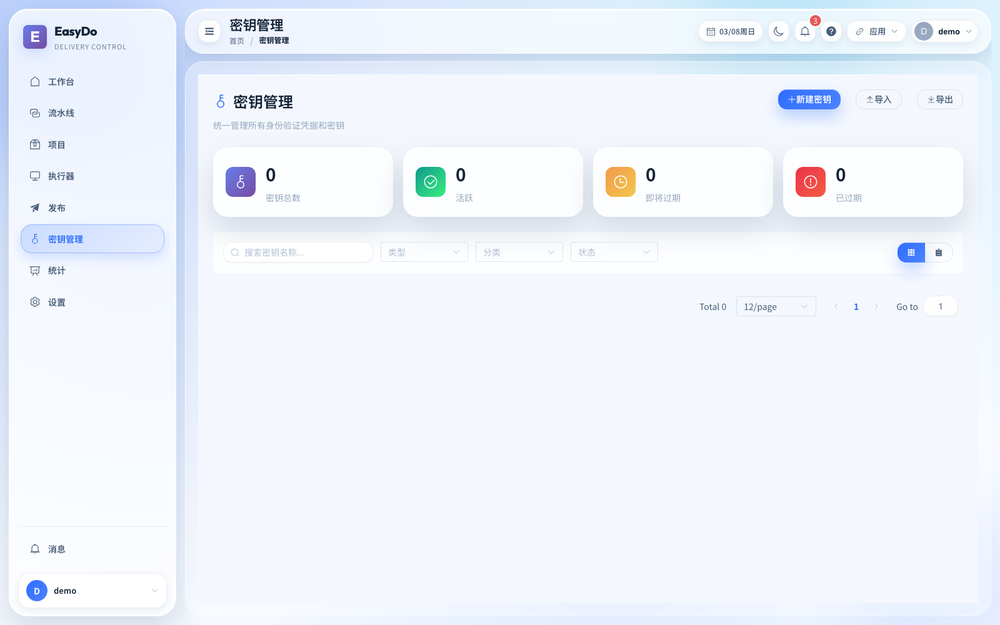

---

## 技术架构 / Tech Stack

### 🖥️ 前端技术栈 / Frontend Tech Stack

| 技术 / Technology | 版本 / Version | 用途 / Purpose |
|------|------|------|
| Vue.js | 3.4+ | 核心框架 / Core Framework |
| Vue Router | 4.2+ | 路由管理 / Routing |
| Pinia | 2.1+ | 状态管理 / State Management |
| Axios | 1.6+ | HTTP 客户端 / HTTP Client |
| Element Plus | 2.4+ | UI 组件库 / UI Component Library |
| Vite | 5.x | 构建工具 / Build Tool |
| Sass | 1.69+ | CSS 预处理器 / CSS Preprocessor |

### ⚙️ 后端技术栈 / Backend Tech Stack

| 技术 / Technology | 版本 / Version | 用途 / Purpose |
|------|------|------|
| Go | 1.21 | 核心语言 / Core Language |
| Gin | 1.9+ | Web 框架 / Web Framework |
| GORM | 1.25+ | ORM 框架 / ORM Framework |
| MySQL | 8.0 | 主数据库 / Primary Database |
| Redis | 7.x | 缓存/会话 / Cache/Session |
| JWT | 5.2+ | 认证授权 / Authentication |
| Viper | 1.18+ | 配置管理 / Configuration |

### 🐳 基础设施 / Infrastructure

- **Docker** - 容器化运行时 / Container Runtime
- **Docker Compose** - 多容器编排 / Multi-container Orchestration
- **Nginx** - 前端服务与反向代理 / Frontend & Reverse Proxy
- **MySQL** - 关系型数据库 / Relational Database
- **Redis** - 缓存与会话存储 / Cache & Session Storage

---

## 项目结构 / Project Structure

```
easydo/
├── 📁 easydo-frontend/          # 前端项目 (Vue 3) / Frontend Project (Vue 3)
│   ├── 📁 src/
│   │   ├── 📁 api/              # API 接口封装 / API Interfaces
│   │   ├── 📁 assets/           # 静态资源 / Static Assets
│   │   ├── 📁 components/       # 公共组件 / Common Components
│   │   ├── 📁 router/           # 路由配置 / Router Config
│   │   ├── 📁 stores/           # Pinia 状态管理 / Pinia State
│   │   ├── 📁 views/            # 页面组件 / Page Components
│   │   ├── 📁 utils/            # 工具函数 / Utilities
│   │   ├── App.vue              # 根组件 / Root Component
│   │   └── main.js              # 入口文件 / Entry File
│   ├── 📁 public/               # 公共静态文件 / Public Static Files
│   ├── index.html               # HTML 模板 / HTML Template
│   ├── vite.config.js           # Vite 配置 / Vite Config
│   ├── package.json             # 项目依赖 / Dependencies
│   └── Dockerfile               # Docker 构建文件 / Docker Build File
│
├── 📁 easydo-server/            # 后端项目 (Go) / Backend Project (Go)
│   ├── 📁 cmd/                  # 入口文件 / Entry Files
│   ├── 📁 internal/
│   │   ├── 📁 config/           # 配置管理 / Configuration
│   │   ├── 📁 handlers/         # HTTP 处理器 / HTTP Handlers
│   │   ├── 📁 middleware/       # 中间件 / Middleware
│   │   ├── 📁 models/           # 数据模型 / Data Models
│   │   ├── 📁 repository/       # 数据访问层 / Data Access Layer
│   │   ├── 📁 routers/          # 路由定义 / Route Definitions
│   │   └── 📁 services/         # 业务逻辑层 / Business Logic
│   ├── 📁 pkg/                  # 公共包 / Common Packages
│   ├── config.yaml              # 配置文件 / Config File
│   ├── go.mod                   # Go 依赖 / Go Dependencies
│   └── Dockerfile               # Docker 构建文件 / Docker Build File
│
├── 📁 easydo-agent/             # 执行器 Agent (Go) / Executor Agent (Go)
│   ├── 📁 cmd/                  # 入口文件 / Entry Files
│   ├── 📁 internal/
│   │   ├── 📁 client/           # 客户端实现 / Client Implementation
│   │   ├── 📁 executor/          # 执行器 / Executor
│   │   └── 📁 types/            # 类型定义 / Type Definitions
│   ├── go.mod                   # Go 依赖 / Go Dependencies
│   └── Dockerfile               # Docker 构建文件 / Docker Build File
│
├── 📁 docker-compose.yml        # Docker Compose 编排配置
├── 📁 Makefile                  # Make 命令集合 / Make Commands
├── 📁 AGENTS.md                 # 项目开发规范 / Development Guidelines
├── 📁 README.md                 # 项目说明文档 / Project Documentation
└── 📁 docs/                    # 文档目录 / Documentation Directory
```

---

## 快速开始 / Quick Start

### 环境要求 / Environment Requirements

| 工具 / Tool | 最低版本 / Min Version | 推荐版本 / Recommended |
|------|----------|----------|
| Docker | 20.x | 24.x |
| Docker Compose | 2.x | 2.x |
| Node.js | 18.x | 20.x |
| Go | 1.21 | 1.21+ |
| Git | 2.x | 2.x |

### ⚡ 使用 Makefile（推荐）/ Using Makefile (Recommended)

```bash
# 查看所有可用命令 / View all available commands
make

# 一键编译所有项目 / Build all projects
make build

# 一键启动所有服务（后台运行）/ Start all services (background)
make up

# 一键停止所有服务 / Stop all services
make down

# 查看服务状态 / View service status
make status

# 查看服务日志 / View service logs
make logs

# 重启所有服务 / Restart all services
make restart
```

### 🚀 Docker 启动 / Docker Startup

```bash
# 克隆项目 / Clone project
git clone <repository-url>
cd easydo

# 构建并启动所有服务 / Build and start all services
docker-compose up -d --build

# 查看服务状态 / View service status
docker-compose ps

# 查看服务日志 / View service logs
docker-compose logs -f
```

### 访问应用 / Access Application

- 前端 / Frontend：`http://localhost`
- 后端 API / Backend API：`http://localhost:8080`

---

## 测试账号 / Test Accounts

| 用户名 / Username | 密码 / Password | 角色 / Role | 描述 / Description |
|--------|------|------|------|
| demo | 1qaz2WSX | 普通用户 / User | 演示用户账号 / Demo User Account |
| admin | 1qaz2WSX | 管理员 / Admin | 系统管理员账号 / System Admin Account |
| test | 1qaz2WSX | 普通用户 / User | 测试用户账号 / Test User Account |

> ⚠️ **注意 / Note**：首次登录后建议立即修改密码，确保系统安全。/ It is recommended to change the password after first login to ensure system security.

---

<div align="center">

**EasyDo** - 让工作更智能 / Making Work Smarter 🚀

Made with ❤️ by EasyDo Team

</div>
