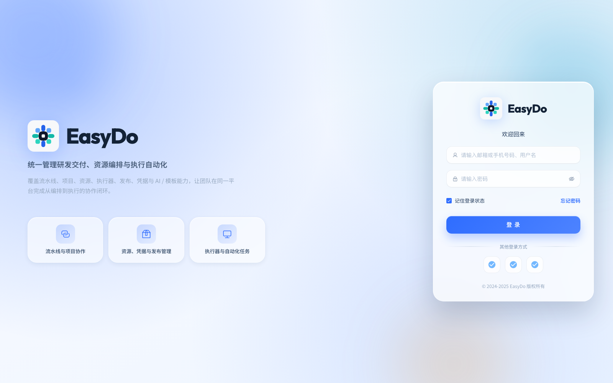
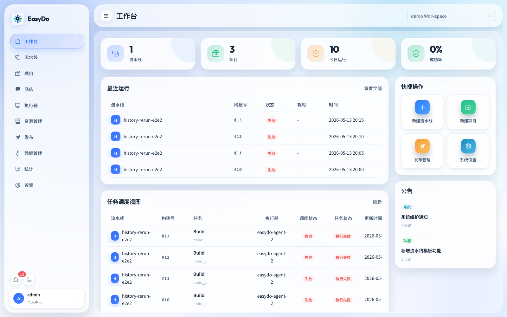
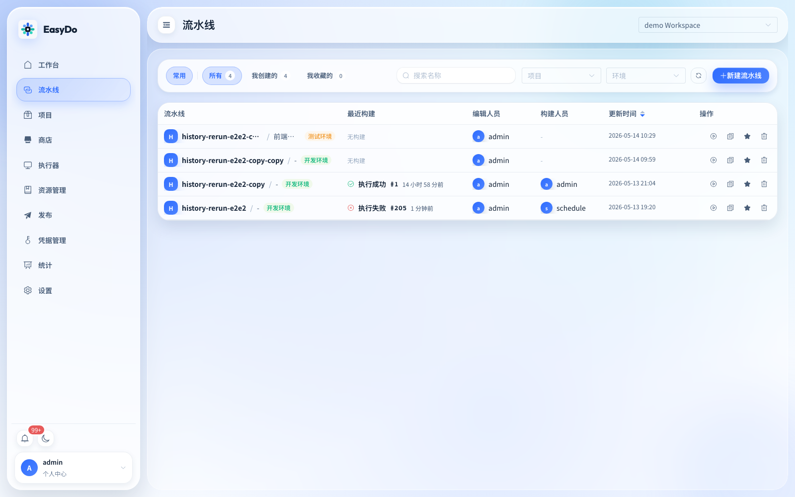
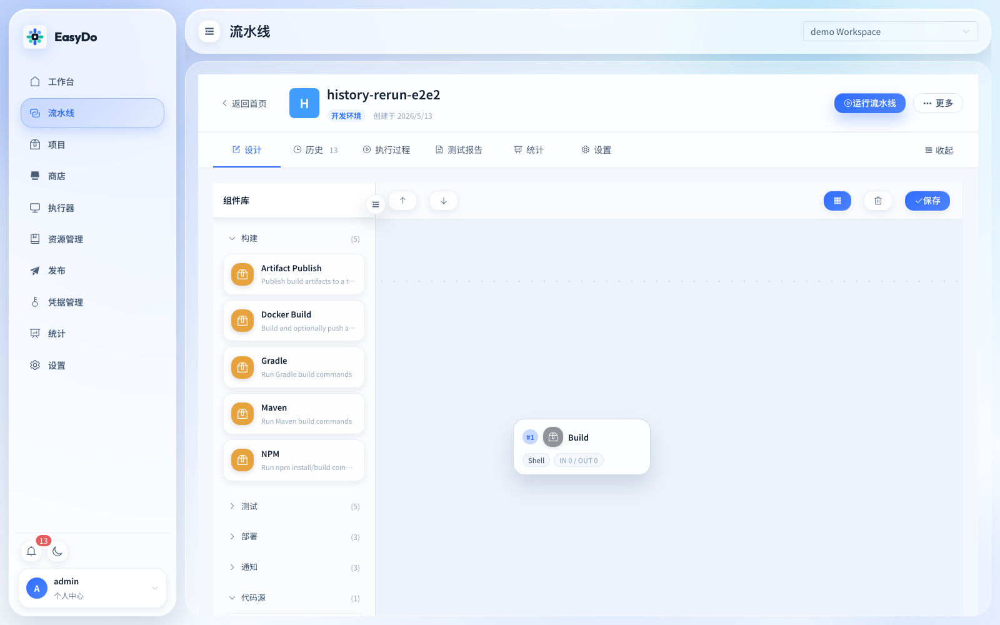
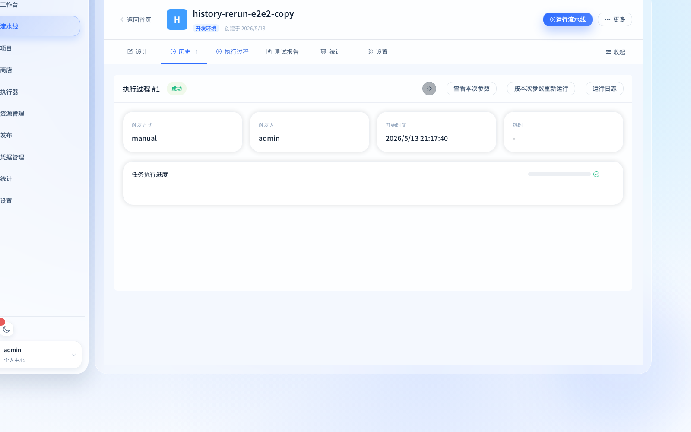
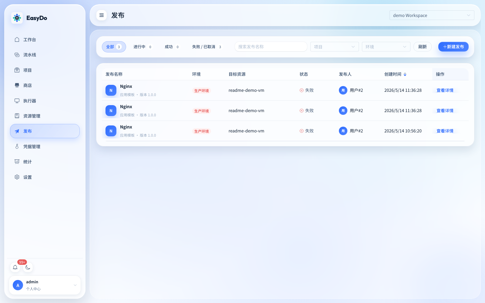
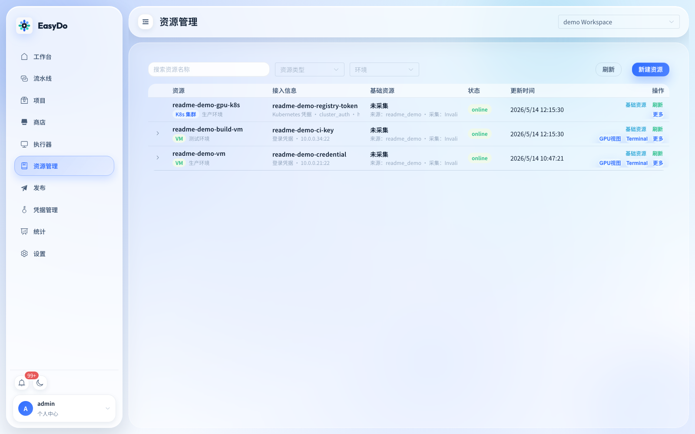
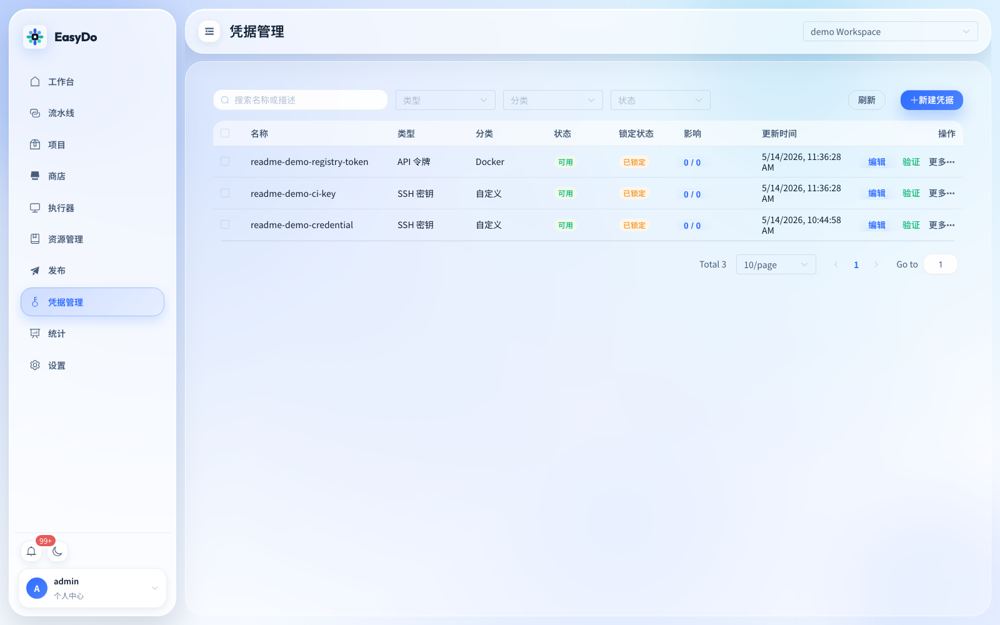

# EasyDo

EasyDo 是一个面向团队协作的智能化工作平台，聚焦流水线编排、发布部署、资源接入与执行调度等核心场景。这个仓库提供完整的前端、服务端、执行器与本地部署材料，方便你快速体验平台能力，或在此基础上继续扩展。

## 目录

- [项目简介](#项目简介)
- [核心能力概览](#核心能力概览)
- [系统架构与模块组成](#系统架构与模块组成)
- [本地 Docker 部署](#本地-docker-部署)
- [界面截图](#界面截图)
- [项目结构与补充说明](#项目结构与补充说明)

## 项目简介

EasyDo 以“统一管理研发执行链路”为目标，将常见的 DevOps 与平台工程能力收敛到一个界面中：从流水线设计、任务执行、发布部署，到工作空间、凭据、资源与执行器协同，尽量减少团队在多套系统之间切换的成本。

对于第一次进入仓库的读者，可以把 EasyDo 理解为一套可本地启动、可继续演进的完整平台样例：

- 用 `easydo-frontend` 提供统一的 Web 界面
- 用 `easydo-server` 承载 API、状态管理与业务编排
- 用 `easydo-agent` 负责任务执行、日志回传与资源联动
- 用 `deploy/` 提供基于 Docker 的本地启动路径

## 核心能力概览

EasyDo 当前重点覆盖以下平台能力：

- 流水线与任务编排：支持流水线列表、DAG 设计、运行跟踪与任务状态流转
- 发布部署：支持面向交付场景的部署入口、过程跟踪与结果查看
- 工作空间与项目协作：提供多空间、多项目下的组织与协同基础
- Agent 执行体系：通过分布式执行器承接任务分发、状态上报与日志回传
- 凭据与资源管理：统一管理常见凭据类型以及 VM、Kubernetes 等资源接入
- 实时交互能力：前端与 Agent 都可通过 WebSocket 与服务端保持实时通信
- 统计与通知支撑：为运行结果、事件变化与平台使用情况提供基础反馈能力

## 系统架构与模块组成

仓库按前端、服务端、执行器与部署材料分层组织：

- `easydo-frontend`：基于 Vue 3 的前端应用，负责平台页面、交互流程与可视化展示
- `easydo-server`：基于 Go 的核心服务，负责 API、鉴权、数据存储、流水线与任务等业务能力
- `easydo-agent`：基于 Go 的执行器组件，负责接收任务、执行过程控制、状态与日志回传
- `deploy`：本地或集成环境所需的部署材料，README 推荐的 Docker 启动路径也从这里落地

从运行关系上看，`easydo-server` 处于控制中心位置，`easydo-frontend` 面向用户提供操作入口，`easydo-agent` 面向执行侧承接任务，三者通过接口与实时连接协同工作。

## 本地 Docker 部署

推荐使用仓库根目录 `Makefile` 作为本地快速启动入口，底层对应的编排文件是 `deploy/docker-compose/docker-compose.yml`。

### 前置依赖

- Docker
- Docker Compose / `docker-compose`
- `make`

### 快速启动

```bash
make up
```

### 常用命令

```bash
make status
make logs
make down
```

### 访问入口

- 前端：`http://localhost:8088`
- 后端 API：`http://localhost:8080`

仓库当前启动路径已包含基础初始化所需的数据准备。若你需要直接登录体验，可使用预置测试账号：`demo / 1qaz2WSX`、`admin / 1qaz2WSX`、`test / 1qaz2WSX`。

## 界面截图

以下截图仅保留最能代表平台主流程的页面，用于快速建立对产品形态的直观认知。

### 登录



### 工作台



### 流水线列表



### 流水线设计



### 流水线运行详情



### 发布部署



### 资源管理



### 凭据管理



## 项目结构与补充说明

```text
easydo/
├── easydo-frontend/   # 前端应用
├── easydo-server/     # 后端服务
├── easydo-agent/      # 执行器组件
├── deploy/            # Docker Compose 等部署材料
├── screenshots/       # README 使用的界面截图
├── docs/              # 补充文档
├── Makefile           # 本地启动与常用运维命令
└── README.md
```

如果你需要继续深入：

- `deploy/docker-compose/docker-compose.yml`：本地 Docker 启动编排文件
- `docs/`：项目补充设计与使用文档目录
- `AGENTS.md`：仓库内开发协作约定
